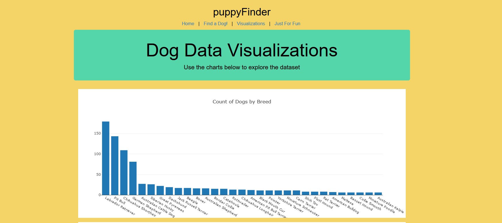

##### Data Analysis & Visualization Bootcamp | UT-Austin McCombs | Fall 2020
##### David Vance, Jessica Bates, Michelle Nguyen, Rachel Reynolds, Reid Haynie, & Sabrina Saleh

# **Project 2: Puppy Finder**

Link: https://project2-petselect.herokuapp.com/

## Key Features:
Our app connects the users to their perfect puppy. It begins with a survey, where the users can input information about their preferred puppy "size" (small, medium, and large) and puppy "characteristics" (playful, active, loving, sensitive, etc.). The output then produces a list of puppy "breed" that matches with the specified preferences. For a particular "breed", the users can continue to select additional puppy features; such as gender, color, age, and health condition. As the final outcome, the app generates a list of desirable puppies that are available for adoption at the Austin Animal Center. 

## Static & Dynamic Dataset:
To develop the "Puppy Finder" app, we have utilized two types of data; static data for the user input of puppy "size" and puppy "characteristics" and dynamic data for the available puppies for adoption by "gender", "color", "age", and "health condition".

The static "size" data is defined by three categories - small (under 20 pounds), medium (20 to 60 pounds), and large (60+ pounds). The static "characteristics" data is defined by 37 categories; for creating the "characteristics" data, we have extracted the Temperament attribute from the following api: https://api.thedogapi.com/v1/breeds

To make sure, our app is accessing the latest data of the Austin Animal Center in producing the final puppy list, our Mongo-Atlas database is programmatically updated to generate the up-to-date daily data. To extract the most recent data on the available puppies and their features, we have used the following api and got it connected to our dynamic Mongo-Atlas database: https://data.austintexas.gov/resource/wter-evkm.json

## Additional Features:
The "Puppy Finder" app includes a visualization page, which provides a visual representation the of Austin Animal Center data. Users can explore the plots/charts for a quick summary. Also, the app includes a fun page for the puppy lovers. Users can play games in the fun page and go to the youtube links to watch informative videos on the puppy breeds.  

## Applied Technologies:
* Api & JSON
* Python, PyMongo, & Mongo-DB
* HTML, CSS, & Jinja
* JavaScript & D3
* Plotly Visualizations
* Flask
* Heroku

## Highlights of Tasks:
* Stacks queries of Mongo DB as a list of dictionaries to combine search parameters as a single DB query
* 
* 

## App Routes:
* @app.route("/")
* @app.route("/findapup")
* @app.route("/findapup/create-entry", methods=["POST", "GET"])
* @app.route("/findapup/mongo-query", methods=["POST", "GET"])
* @app.route("/all-dogs")
* @app.route("/visualizations")
* @app.route("/fun_page")

## Screen Shot: FIND A DOG

## Screen Shot: FIND TOP 5 DOG BREEDS 

## Screen Shot: FINAL LIST 

## Screen Shot: VISUALIZATIONS
* This page provides interactive plotly plots for breed, gender, age, color, type, and condition.

## Screen Shot: FUN PAGE
* This page offers fun games and informative videos for puppy lovers.

## Limitations & Future Plan:
* 
* 
* "Visualizations" page does not include any selector. We plan to address this limitation by including a selector for puppy "breeds" and make the page more interactive, where the users can visualize the dynamic plots according to their "breed" choice.
* Link visualizations to live data rather than static JSON file.

